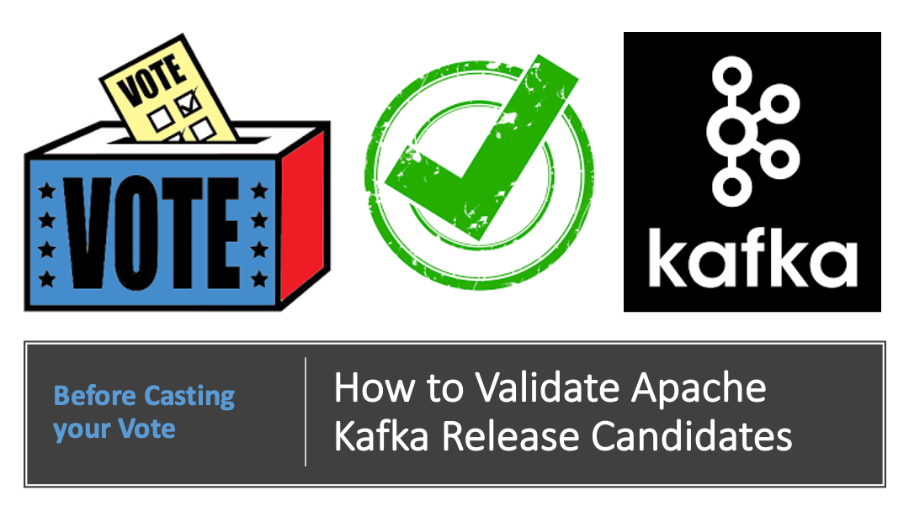

# How to Validate Apache Kafka Release Candidates


This repository contains steps and guidance for how to validate Apache Kafka Release Candidates prior to voting for the release artifacts.

 As part of [an effort](https://issues.apache.org/jira/browse/KAFKA-9861) ([KAFKA-9861](https://issues.apache.org/jira/browse/KAFKA-9861)) to get more community participation during release candidate (RC) validations, I have created the following steps to hopefully allow more community members to participate thoroughly in this validation process prior to casting their votes for specific RCs. This has been tested and used to validate the release candidates for the Apache Kafka 2.8.x and 3.0.x series.

This effort was inspired by [a tool](https://github.com/elalonde/kafka) created by [
Eric Lalonde](https://github.com/elalonde) for the Apache Kafka 2.2.x releases in 2019 which enabled me to participate in subsequent release candidate validations prior to voting for the release artifacts.

It is my hope that more community members will be able to participate in the process as a result. If you have any suggestions for improvement or would like to share changes, please feel free to send in a pull request or open issues against this github repo.  You may also reach out to me directly. 

Thanks in advance for your participation.

## Objectives of Validation
Prior to voting for the release candidates, we plan to validate the following:
- PGP Signatures used to sign the release artifacts
- Validation of Release Artifacts Cryptographic Hashes (ASC MD5 SHA1 SHA512)
- Verifying Kafka Source Tree and running tests
- Validation of Kafka Site Documentation
- Validation of Javadocs
- Validation of Cluster Setup for KRaft and Legacy Modes


## Base URLs for Latest Release Candidates

For the 3.0.0 Release Candidate, you can you this URL:

https://home.apache.org/~kkarantasis/kafka-3.0.0-rc2/

For the 2.8.1 RC, you can use this as the base URL:

https://home.apache.org/~dajac/kafka-2.8.1-rc1/

You can specify these as environment variables in your Dockerfile as needed.

## Currently Supported Validations
These are validations that are currently supported
- Validation of Hashes
- Validation of GPG Keys
- Validation of Source Code
- Validation of Site Documentation
- Running Brokers in KRaft Mode (without Zookeeper)
- Running Multi-Node Brokers in Legacy Mode (With Zookeeper)


## Planned Validations to be Added Soon
These are validations we are planning to add soon:
- Validation of JavaDocs

## Fetching the Git Resources
You can clone this git repo by issuing the following command in your Terminal and then navigating to the checked out folder/directory:

```shell

# Fetch the remote git repository
git clone git@github.com:izzyacademy/apache-kafka-release-party.git

# Navigate to the local git repo
cd apache-kafka-release-party
```

Please add the appropriate environment variables in your Dockerfile accordingly.

## Validation of Hashes, GPG Keys and Source Code

To validate the cryptographic hashes of the artifacts, please follow the following steps to set up the local environment:

```shell

# Navigate to the Artifact Validation Folder
cd artifact-validation

# Create the local docker image needed
docker build . -f Validation.Dockerfile -t izzyacademy/kafka-artifact-base:3.0.0-rc2

# Fire up the Docker Compose instance to boot up the Docker container(s)
cd compose 
docker-compose up

# Log into the running container
docker exec -it validator /bin/bash


# To shut down the contain run the following command after exiting:
docker-compose down --remove-orphans

```


### GPG Key Validation Steps 

Run the following command inside the Docker image to validate the GPG keys:

After the command is run, please compare the fingerprints used to sign the artifacts to the fingerprints that have been imported:

```shell

./verify-artifacts.sh verify_signatures

```

### Cryptographic CheckSum Validation Steps 

Run the following command inside the Docker image to validate MD5, SHA1 and SHA512 Checksums of the downloaded artifacts:


```shell

./verify-artifacts.sh verify_hash

```

### Validation of Source Code (Running Tests and Other Checks)

Run the following command to validate the source code:

```shell

./verify-artifacts.sh verify_source

```

## Site Docs Validation

To validate the site documents, you need to run the commands below and at the end you can browse the site docs using URLs similar to the following for the 3.0.0 and 2.8.0 releases:

- http://localhost/30/documentation.html
- http://localhost/28/documentation.html
- http://localhost/27/documentation.html

```shell

# Navigate to the Artifact Validation Folder
cd docs-validation

# Create the local docker image needed
docker build . -f Docs.Dockerfile -t izzyacademy/kafka-docs:3.0.0-rc2

# Fire up the Docker Compose instance to boot up the Docker container(s)
cd compose 
docker-compose up

# (Optional) You can log into the running container for exploration, if you wish
docker exec -it kafkadocs /bin/bash


# To shut down the contain run the following command after exiting:
docker-compose down --remove-orphans

```

Once the docker-compose up command is issued, you can browse the documentation sites relevant to your Apache Kafka release version:

- http://localhost/30/documentation.html (for 3.0.x)
- http://localhost/28/documentation.html (for 2.8.x)
- http://localhost/27/documentation.html (for 2.7.0)

This is based on what is available here (in the root folder)

https://github.com/apache/kafka-site

## Cluster Validation

To validate cluster setup in KRaft and Legacy Mode, you can follow the instructions below

### Building the Docker Images to Prep for Use in Docker Compose/Kubernetes

Once the repository has been checked out to your local environment (laptop, desktop), you can build the Docker images and have them ready for use within your Docker Compose or Kubernetes setup:

When building the docker images, please use image tags (like 3.0.0-rc2) that reflects the target Release Candidate Number, release version and other relevant configs. This will help reduce confusion later. Trust me on this!

You may run the following commands, to build the Docker images:

```shell

# Navigate to the Cluster Validation Folder
cd cluster-validation

# This builds the base binary image for your specified RC, version number and Scala version

docker build . -f Binary-Base.Dockerfile -t izzyacademy/kafka-binary-base:3.0.0-rc2

# Building the Docker image for Zookeeper container(s)

docker build . -f Zookeeper.Dockerfile -t izzyacademy/zookeeper:3.0.0-rc2

# Building the Docker image for Kafka Broker container(s)

docker build . -f Broker.Dockerfile -t izzyacademy/kafka-broker:3.0.0-rc2

# Building the Docker image for Kafka Connect container(s)

docker build . -f Connect.Dockerfile -t izzyacademy/kafka-connect:3.0.0-rc2

```


### Running the Containers in Docker Compose

The following sections describe how to run the docker images as Kafka clusters

The first section describes how to run a Kafka cluster in Zookeeper mode (legacy mode)

The second section describes how to run a single and multi-node cluster in KRaft mode (without Zookeeper)

#### Running in Legacy Mode (With Zookeeper)

It provides a 3-node cluster that depends on Zookeeper

- Zookeeper Instance
- Node 1 (Broker)
- Node 2 (Broker)
- Node 3 (Broker)

```shell

cd compose/legacy

# Deploys a multi-node cluster using Zookeeper 
docker-compose up

# Shuts down containers
docker-compose down --remove-orphans

```

#### Running in KRaft Mode (Single-Node Cluster)

This setup creates a single node cluster that runs without Zookeeper

```shell

cd compose/kraft

# Deploys a simple single-node cluster in KRaft Mode
docker-compose up

# Shuts down the containers
docker-compose down --remove-orphans
```

#### Running in KRaft Mode (Multi-Node Cluster)

This deploys a multi-node cluster in KRaft mode (without Zookeeper)

- Node 1 (Controller)
- Node 2 (Broker)
- Node 3 (Controller, Broker)
- Node 4 (Controller, Broker)

This provides 3 controller nodes and 3 broker nodes (6-nodes altogether)

Which ends up looking like this when you expand it:

- Node 1 (Controller)
- Node 2 (Broker)
- Node 3 (Controller)
- Node 3 (Broker)
- Node 4 (Controller)
- Node 4 (Broker)

It also has a debugger docker container that you can log in to explore the cluster

Running the following commands allow you to boot up the cluster

```shell

cd compose/kraft

# Deploys a multi-node cluster in KRaft Mode
docker-compose --env-file ./environment-variables.sh -f multi-node-docker-compose.yml up

# Shuts down the containers
docker-compose --env-file ./environment-variables.sh -f multi-node-docker-compose.yml down --remove-orphans

```

#### Commands to Explore the Cluster in Kraft Mode

These commands are primarily for exploring the cluster in KRaft mode without Zookeeper.

However, you can also use the syntax for creating topics to interact with clusters in legacy mode.

```shell
# Log on to NodeId=2
docker exec -it node2 /bin/bash

# Navigate to the directory
cd /usr/local/software/kafka/bin

./kafka-cluster.sh cluster-id --bootstrap-server localhost:9092

./kafka-log-dirs.sh --describe --bootstrap-server localhost:9092

./kafka-storage.sh info -c ../config/broker.izzy.properties

./kafka-broker-api-versions.sh --bootstrap-server localhost:9092

./kafka-metadata-shell.sh  --snapshot /tmp/kraft-logs/@metadata-0/00000000000000000000.log

# Then explore the following metadata, if present : brokers  local  metadataQuorum  topicIds  topics

./kafka-topics.sh --bootstrap-server localhost:9092 --create --topic citypopulation --partitions 1 --replication-factor 1

./kafka-topics.sh --bootstrap-server localhost:9092 --create --topic countrypopulation --partitions 2 --replication-factor 1

./kafka-topics.sh --bootstrap-server localhost:9092 --create --topic worldcapitals --partitions 3 --replication-factor 2

./kafka-topics.sh --bootstrap-server localhost:9092 --create --topic uscapitals --partitions 3 --replication-factor 5

./kafka-topics.sh --bootstrap-server localhost:9092 --list

./kafka-topics.sh --bootstrap-server localhost:9092 --describe uscapitals

./kafka-topics.sh --bootstrap-server localhost:9092 --describe worldcapitals

./kafka-topics.sh --bootstrap-server localhost:9092 --describe countrypopulation

./kafka-topics.sh --bootstrap-server localhost:9092 --describe citypopulation

./kafka-metadata-shell.sh  --snapshot /tmp/kraft-logs/@metadata-0/00000000000000000000.log

# Then explore the following metadata, if present : brokers  local  metadataQuorum  topicIds  topics

# Keys with numbers as the keys and the square roots as the value
bin/kafka-console-producer.sh --broker-list localhost:9092 --topic freedomzone --property "parse.key=true" --property "key.separator=,"

64,Eight
100,Ten
4,Two
1,One

# https://www.britannica.com/topic/list-of-state-capitals-in-the-United-States-2119210

./kafka-console-producer.sh --broker-list localhost:9092 --topic uscapitals --property "parse.key=true" --property "key.separator=:"

Florida:Tallahasee
Georgia:Atlanta
Maine:Augusta
Hawaii:Hononulu

./kafka-console-consumer.sh --new-consumer --bootstrap-server localhost:9092 --topic uscapitals --property print.key=true --property key.separator=":" --from-beginning


```
